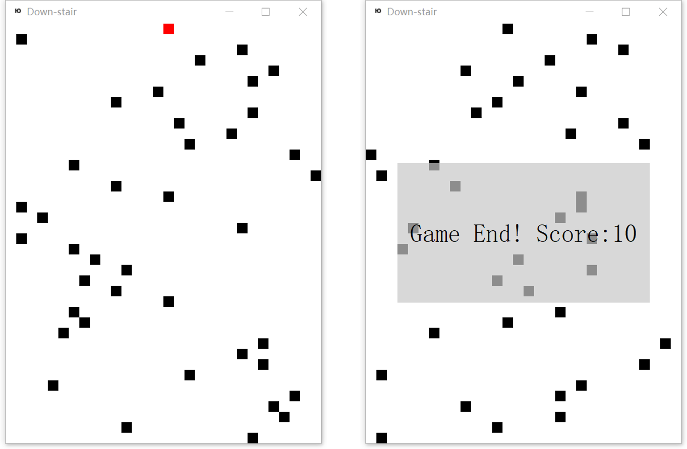

# AlphaDownstair
> Play DownStair Game with AI

## Features
+ Home-made DownStair game

+ Deep Reinforcement learning

## How to Use
+ Play Game by yourself

        cd alphadownstair
        python alphadownstair.py --play

Press Left, Right and Down to play the game.

+ Re-train AI model for game (Coming)
+ Continue to train AI model for game (Coming)
+ Watch AI model to play the game (Coming)

## E-mail
longyang_123@yeah.net  
You're welcome to contact with me to discuss any details about this project

## Extra
Usually, I felt full of doubt about the realistic meaning about these toy projects. But one thing, which I'm very sure, is that I'm making progress and understand the inner learning mechanism better and better. 